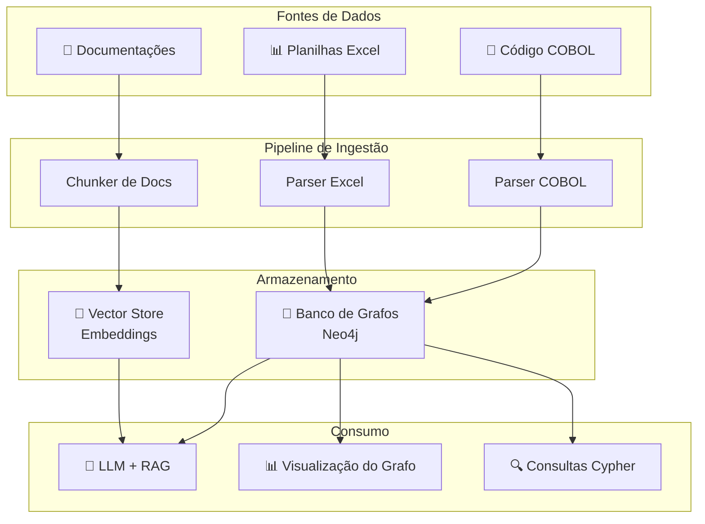
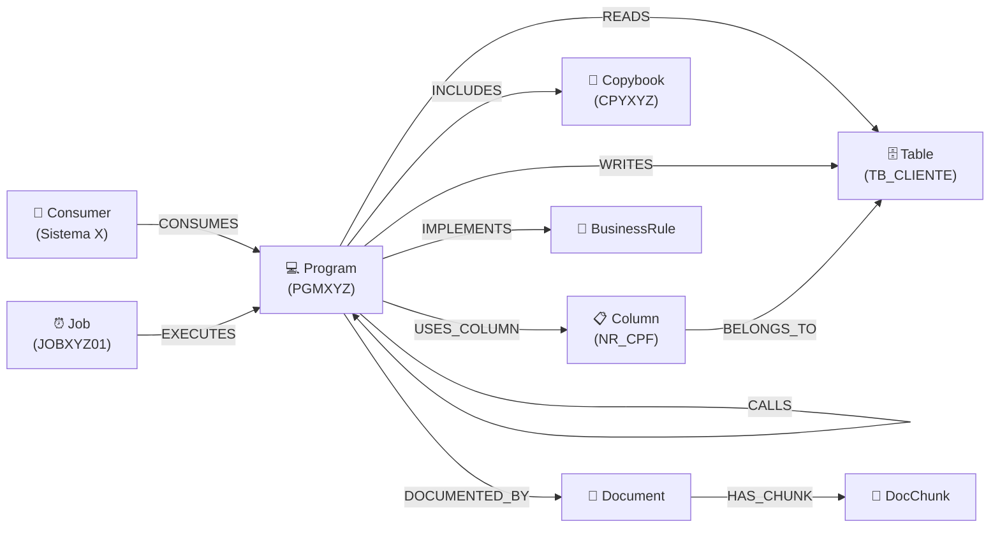
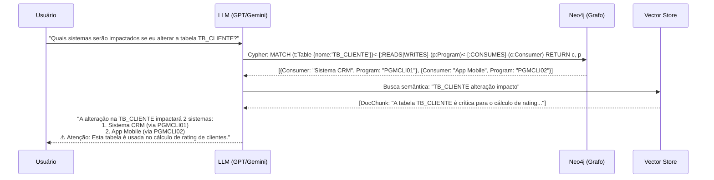

# Estratégia de Modernização do Mainframe com Grafo de Conhecimento + IA

## 🎯 Visão Geral

O objetivo é construir um **Grafo de Conhecimento (Knowledge Graph)** que unifique toda a informação do legado mainframe — código COBOL, tabelas DB2, consumidores, documentações e planilhas — em uma estrutura navegável e consultável por IA.



---

## 📐 Arquitetura do Grafo — Modelo de Nós e Relacionamentos

### Nós (Nodes)

| Tipo de Nó | Origem | Exemplos de Propriedades |
|---|---|---|
| `Program` | Código COBOL | nome, tipo (batch/online), data_alteração, linhas_código |
| `Copybook` | Código COBOL | nome, caminho |
| `Table` | Código COBOL (SQL embutido) | nome_tabela, schema, banco (DB2) |
| `Column` | Código COBOL (SQL embutido) | nome_coluna, tipo_dado |
| `Job` | JCL / Excel | nome_job, schedule, frequência |
| `Consumer` | Planilha Excel | nome_sistema, área, responsável, criticidade |
| `Interface` | Planilha Excel / Docs | tipo (MQ, arquivo, API, CICS), nome |
| `Document` | Documentações | título, tipo (manual, especificação, RD), caminho |
| `DocChunk` | Documentações (chunked) | texto, embedding_id, página |
| `BusinessRule` | Documentações / COBOL | descrição, domínio |

### Relacionamentos (Edges)

| Relacionamento | De → Para | Descrição |
|---|---|---|
| `READS` | Program → Table | O programa faz SELECT na tabela |
| `WRITES` | Program → Table | O programa faz INSERT/UPDATE/DELETE |
| `CALLS` | Program → Program | CALL entre programas |
| `INCLUDES` | Program → Copybook | COPY statement |
| `USES_COLUMN` | Program → Column | Colunas referenciadas no SQL |
| `EXECUTED_BY` | Program → Job | O JCL executa o programa |
| `CONSUMES` | Consumer → Program | Sistema consumidor da rotina |
| `PRODUCES` | Program → Interface | Output gerado (arquivo, fila MQ) |
| `CONSUMES_INTERFACE` | Consumer → Interface | Consumo via interface |
| `DOCUMENTED_BY` | Program → Document | Documentação associada |
| `HAS_CHUNK` | Document → DocChunk | Pedaços do documento |
| `IMPLEMENTS` | Program → BusinessRule | Regra de negócio implementada |
| `BELONGS_TO` | Column → Table | Coluna pertence à tabela |



---

## 🔧 Pipeline de Ingestão — Como Extrair os Dados

### 1. Parser COBOL → Nós e Relacionamentos

O parser precisa extrair do código COBOL:

```
┌─────────────────────────────────────────────────────┐
│  Código COBOL                                       │
│                                                     │
│  EXEC SQL                                           │
│    SELECT NR_CPF, NM_CLIENTE        ──► READS Table │
│    FROM TB_CLIENTE                      USES_COLUMN │
│    WHERE CD_AGENCIA = :WS-AGENCIA                   │
│  END-EXEC                                           │
│                                                     │
│  CALL 'PGMXYZ02' USING WS-AREA     ──► CALLS Prog  │
│                                                     │
│  COPY CPYXYZ01                      ──► INCLUDES    │
│                                                     │
│  EXEC SQL                                           │
│    INSERT INTO TB_LOG_OPERACAO      ──► WRITES Table │
│  END-EXEC                                           │
└─────────────────────────────────────────────────────┘
```

**Estratégia de parsing (do mais simples ao mais robusto):**

| Nível | Técnica | Prós | Contras |
|---|---|---|---|
| 1️⃣ Básico | Regex / grep | Rápido, funciona hoje | Perde contexto, falsos positivos |
| 2️⃣ Intermediário | Parser com gramática (ANTLR/tree-sitter) | Preciso, estruturado | Mais trabalho inicial |
| 3️⃣ Avançado | LLM-assisted parsing | Entende semântica | Custo, alucinações |

> [!TIP]
> **Recomendação**: Comece com **Nível 1 (regex)** para ter resultados rápidos e validar o conceito. É surpreendentemente eficaz para COBOL porque a sintaxe é muito regular. Depois evolua para ANTLR se precisar de mais precisão.

**Padrões regex úteis para COBOL:**

```python
# Exemplo de extração com Python
import re

# Tabelas referenciadas (SELECT, INSERT, UPDATE, DELETE)
sql_tables = re.findall(
    r'(?:FROM|INTO|UPDATE|JOIN)\s+([A-Z0-9_]+)',
    cobol_source, re.IGNORECASE
)

# CALLs entre programas
calls = re.findall(
    r"CALL\s+['\"]([A-Z0-9]+)['\"]",
    cobol_source
)

# COPYs (copybooks)
copies = re.findall(
    r'COPY\s+([A-Z0-9]+)',
    cobol_source
)

# Colunas no SQL (simplificado)
columns = re.findall(
    r'SELECT\s+(.*?)\s+FROM',
    cobol_source, re.DOTALL
)
```

### 2. Parser Excel → Consumidores e Jobs

```python
import pandas as pd

# Carregar planilha de consumidores
df = pd.read_excel('consumidores_rotinas.xlsx')

# Cada linha vira um relacionamento CONSUMES
for _, row in df.iterrows():
    # Criar nó Consumer
    graph.create_node('Consumer', {
        'nome': row['sistema'],
        'area': row['area_responsavel'],
        'criticidade': row['criticidade']
    })
    # Criar relacionamento
    graph.create_relationship(
        row['sistema'], 'CONSUMES', row['programa_cobol']
    )
```

### 3. Documentações → Chunks + Embeddings (para RAG)

```
┌──────────────────────────────────────────────────────────┐
│                    Documento Original                     │
│  "O programa PGMXYZ01 realiza o cálculo de juros         │
│   compostos para operações de crédito. Utiliza a         │
│   tabela TB_TAXA_JUROS para obter as taxas vigentes..."  │
└──────────────┬───────────────────────────────────────────┘
               │
               ▼  Chunking (500-1000 tokens por chunk)
┌──────────────────────┐  ┌──────────────────────┐
│  DocChunk 1           │  │  DocChunk 2           │
│  "O programa PGMXYZ01 │  │  "Utiliza a tabela    │
│   realiza o cálculo..." │  │   TB_TAXA_JUROS..."   │
│                        │  │                        │
│  embedding: [0.12,     │  │  embedding: [0.34,     │
│   0.45, 0.78, ...]     │  │   0.12, 0.56, ...]     │
└──────────┬─────────────┘  └──────────┬─────────────┘
           │                           │
           ▼                           ▼
    Linked no Grafo              Linked no Grafo
    ao nó Program                ao nó Table
    "PGMXYZ01"                   "TB_TAXA_JUROS"
```

> [!IMPORTANT]
> **O segredo está em linkar os DocChunks ao grafo!** Quando você faz o chunking, também extrai as entidades mencionadas (nomes de programas, tabelas) e cria relacionamentos no grafo. Assim, quando a IA busca no grafo, ela também encontra a documentação relevante.

---

## 🗄️ Tecnologias Recomendadas

### Banco de Grafos: **Neo4j**

| Aspecto | Detalhe |
|---|---|
| **Por que Neo4j?** | Líder de mercado, Cypher é intuitivo, tem versão Community gratuita |
| **Alternativas** | Amazon Neptune, ArangoDB, JanusGraph |
| **Visualização** | Neo4j Browser (nativo), Neo4j Bloom (enterprise) |
| **Integração IA** | Plugin oficial para LangChain e LlamaIndex |

### Vector Store: **Integrado ao Neo4j** ou **Separado**

| Opção | Quando usar |
|---|---|
| Neo4j Vector Index (nativo) | Se quer simplicidade — tudo em um banco só |
| ChromaDB / Weaviate / Pinecone | Se precisa de escala ou já usa um desses |

### Framework de IA: **LangChain** ou **LlamaIndex**

Ambos suportam o padrão **GraphRAG** que combina:
1. Busca no grafo (Cypher) para contexto estruturado
2. Busca vetorial para contexto semântico (documentações)
3. LLM para gerar resposta em linguagem natural

---

## 🤖 Como a IA Usa o Grafo — Arquitetura GraphRAG



### Exemplos de Perguntas que a IA Conseguirá Responder

| Pergunta | Tipo de Busca |
|---|---|
| "Quais programas acessam a TB_CLIENTE?" | Grafo (Cypher) |
| "Qual o impacto de desligar o JOB JOBXYZ01?" | Grafo (travessia de dependências) |
| "O que faz o programa PGMXYZ01?" | Grafo + RAG (documentação) |
| "Quais regras de negócio envolvem cálculo de juros?" | RAG (busca semântica) |
| "Qual a ordem de migração ideal para desacoplar o módulo de crédito?" | Grafo (análise de acoplamento) + LLM |
| "Quais consumidores de alta criticidade dependem de tabelas sem documentação?" | Grafo (join entre Consumer e Document) |

---

## 📋 Plano de Execução em Fases

### Fase 1 — MVP do Grafo (2-3 semanas)
- [ ] Escolher 10-20 programas COBOL representativos
- [ ] Criar parser regex para COBOL (tabelas, calls, copybooks)
- [ ] Importar 1 planilha Excel de consumidores
- [ ] Subir Neo4j (Docker) e popular com os dados
- [ ] Validar visualmente no Neo4j Browser
- [ ] **Entregável**: Grafo navegável com ~100 nós

### Fase 2 — Escala + Documentação (2-4 semanas)
- [ ] Expandir parser para todo o acervo COBOL
- [ ] Importar todas as planilhas Excel
- [ ] Fazer chunking das documentações
- [ ] Gerar embeddings e armazenar
- [ ] Linkar DocChunks às entidades do grafo
- [ ] **Entregável**: Grafo completo com documentação integrada

### Fase 3 — IA + Consultas (2-3 semanas)
- [ ] Configurar LangChain/LlamaIndex com GraphRAG
- [ ] Criar interface de chat (Streamlit/Gradio)
- [ ] Implementar templates de perguntas comuns
- [ ] Testar com equipe
- [ ] **Entregável**: Chatbot que responde sobre o legado

### Fase 4 — Análise de Modernização (contínuo)
- [ ] Análise de acoplamento entre módulos
- [ ] Identificar candidatos a microsserviço
- [ ] Mapa de impacto para migrações
- [ ] Priorização baseada em criticidade × complexidade
- [ ] **Entregável**: Roadmap de modernização data-driven

---

## 🛠️ Stack Tecnológica Completa

```
┌─────────────────────────────────────────────────────┐
│  Interface do Usuário                                │
│  ┌──────────────┐  ┌──────────────┐                 │
│  │  Streamlit    │  │  Neo4j       │                 │
│  │  Chat UI      │  │  Browser     │                 │
│  └──────┬───────┘  └──────┬───────┘                 │
│         │                  │                         │
│  ┌──────▼──────────────────▼───────┐                │
│  │  LangChain / LlamaIndex         │                │
│  │  (GraphRAG Orchestrator)         │                │
│  └──────┬──────────────────┬───────┘                │
│         │                  │                         │
│  ┌──────▼───────┐  ┌──────▼───────┐                │
│  │  Neo4j        │  │  Vector      │                │
│  │  (Grafo)      │  │  Store       │                │
│  └──────┬───────┘  └──────────────┘                │
│         │                                            │
│  ┌──────▼───────────────────────────┐               │
│  │  Pipeline de Ingestão (Python)    │               │
│  │  • COBOL Parser (regex/ANTLR)     │               │
│  │  • Excel Parser (pandas)          │               │
│  │  • Doc Chunker (LangChain)        │               │
│  └──────────────────────────────────┘               │
│                                                      │
│  Fontes: COBOL | Excel | Word/PDF | JCL             │
└─────────────────────────────────────────────────────┘
```

---

## ⚠️ Riscos e Mitigações

| Risco | Mitigação |
|---|---|
| COBOL com dialetos não-padrão | Começar com regex + validação manual; evoluir para parser formal |
| Planilhas Excel desatualizadas | Cross-check com o grafo (programas sem consumidor = alerta) |
| Volume de documentação muito grande | Priorizar docs dos programas mais críticos/conectados |
| Resistência da equipe | Mostrar valor rápido com o MVP (Fase 1) |
| Dados sensíveis no grafo | Deploy on-premises, sem dados em cloud pública |

---

## 🔑 Decisões que Você Precisa Tomar

> [!IMPORTANT]
> Antes de começar a implementação, precisamos definir:

1. **Qual banco de grafos usar?** Neo4j Community (gratuito) é suficiente para começar?
2. **Onde rodar?** Docker local, servidor on-premises, ou cloud?
3. **Qual LLM usar?** Gemini, GPT-4, modelo local (Llama)?
4. **Segurança**: Os dados COBOL podem sair da rede interna?
5. **Formato das documentações**: São Word, PDF, Confluence, ou outro?
6. **Formato das planilhas Excel**: Pode me mostrar um exemplo da estrutura (colunas)?
7. **Quantidade aproximada**: Quantos programas COBOL? Quantas tabelas? Quantas planilhas?
