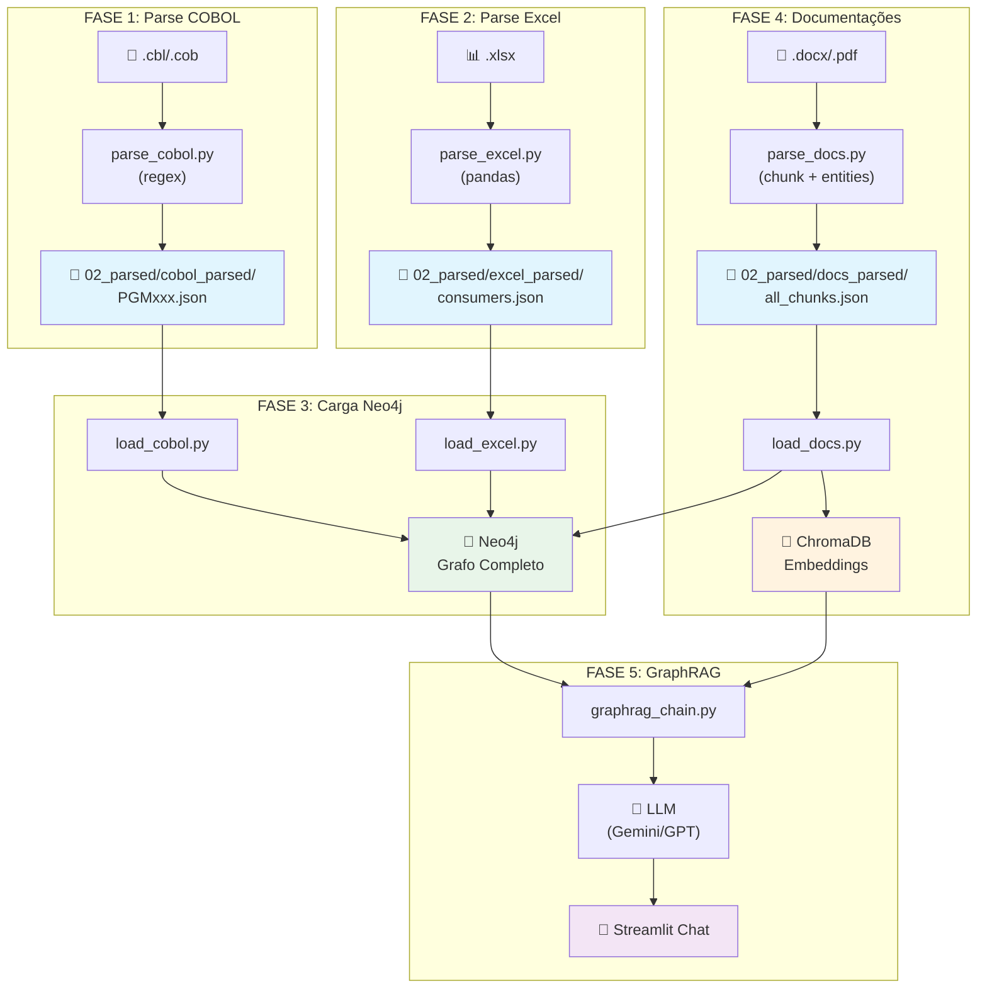

# Guia Passo-a-Passo: Construindo o Knowledge Graph do Mainframe

> [!NOTE]
> Este guia foi escrito para ser seguido **sequencialmente**, fase por fase. Cada fase tem um **checkpoint** no final — só avance quando o checkpoint passar. Isso garante que nada se perca no caminho.

---

## 📁 Estrutura de Pastas do Projeto

Antes de qualquer coisa, crie esta estrutura. Tudo parte daqui.

```
mainframe-knowledge-graph/
│
├── 01_input/                      # TODAS as fontes de dados vão aqui
│   ├── cobol/                     # Código-fonte COBOL (.cbl, .cob, .cpy)
│   ├── excel/                     # Planilhas Excel (.xlsx)
│   ├── docs/                      # Documentações (.docx, .pdf, .txt, .md)
│   └── jcl/                       # JCLs se tiver (opcional)
│
├── 02_parsed/                     # Saída dos parsers (JSONs intermediários)
│   ├── cobol_parsed/              # Um JSON por programa COBOL
│   ├── excel_parsed/              # Um JSON por planilha
│   └── docs_parsed/               # Chunks das documentações
│
├── 03_graph/                      # Scripts de carga no Neo4j
│   ├── load_cobol.py
│   ├── load_excel.py
│   ├── load_docs.py
│   └── schema.cypher              # Constraints e índices do Neo4j
│
├── 04_rag/                        # Pipeline de IA (GraphRAG)
│   ├── graphrag_chain.py
│   └── streamlit_app.py
│
├── scripts/                       # Utilitários
│   ├── parse_cobol.py
│   ├── parse_excel.py
│   └── parse_docs.py
│
├── requirements.txt
├── docker-compose.yml             # Neo4j
└── README.md
```

> [!IMPORTANT]
> **Regra de ouro**: Nunca vá direto da fonte para o Neo4j. Sempre passe pelo estágio intermediário (`02_parsed/`). Assim você pode inspecionar, corrigir e re-processar sem ter que re-parsear tudo.

---

## Fase 0 — Setup do Ambiente

### Passo 0.1 — Subir o Neo4j com Docker

```yaml
# docker-compose.yml
version: '3.8'
services:
  neo4j:
    image: neo4j:5-community
    container_name: mainframe-graph
    ports:
      - "7474:7474"   # Browser UI
      - "7687:7687"   # Bolt (driver)
    environment:
      - NEO4J_AUTH=neo4j/mainframe2024
      - NEO4J_PLUGINS=["apoc"]
      - NEO4J_dbms_memory_heap_max__size=2G
    volumes:
      - neo4j_data:/data
      - neo4j_import:/var/lib/neo4j/import

volumes:
  neo4j_data:
  neo4j_import:
```

```bash
docker-compose up -d
```

Acesse `http://localhost:7474` — login: `neo4j` / senha: `mainframe2024`

### Passo 0.2 — Instalar dependências Python

```txt
# requirements.txt
neo4j==5.27.0
pandas==2.2.3
openpyxl==3.1.5
python-docx==1.1.2
PyPDF2==3.0.1
langchain==0.3.25
langchain-community==0.3.24
langchain-google-genai==2.1.4
chromadb==0.6.3
tiktoken==0.9.0
streamlit==1.45.1
```

```bash
pip install -r requirements.txt
```

### Passo 0.3 — Criar schema no Neo4j

```cypher
// schema.cypher — Executar no Neo4j Browser

// Constraints (garantem unicidade)
CREATE CONSTRAINT program_name IF NOT EXISTS
  FOR (p:Program) REQUIRE p.name IS UNIQUE;

CREATE CONSTRAINT table_name IF NOT EXISTS
  FOR (t:Table) REQUIRE t.name IS UNIQUE;

CREATE CONSTRAINT copybook_name IF NOT EXISTS
  FOR (c:Copybook) REQUIRE c.name IS UNIQUE;

CREATE CONSTRAINT consumer_name IF NOT EXISTS
  FOR (c:Consumer) REQUIRE c.name IS UNIQUE;

CREATE CONSTRAINT job_name IF NOT EXISTS
  FOR (j:Job) REQUIRE j.name IS UNIQUE;

CREATE CONSTRAINT document_id IF NOT EXISTS
  FOR (d:Document) REQUIRE d.doc_id IS UNIQUE;

// Índices para buscas rápidas
CREATE INDEX program_type IF NOT EXISTS
  FOR (p:Program) ON (p.type);

CREATE INDEX table_schema IF NOT EXISTS
  FOR (t:Table) ON (t.schema);
```

### ✅ Checkpoint Fase 0

Verifique:
- [ ] `http://localhost:7474` abre e você consegue logar
- [ ] Rodar `SHOW CONSTRAINTS` no browser mostra as constraints criadas
- [ ] `python -c "from neo4j import GraphDatabase; print('OK')"` funciona

---

## Fase 1 — Parser COBOL → JSONs Intermediários

### O que o parser extrai

Para **cada arquivo COBOL**, o parser gera um JSON com tudo que encontrou:

```json
{
  "program_name": "PGMCLI01",
  "source_file": "PGMCLI01.cbl",
  "lines_of_code": 1247,
  "tables_read": ["TB_CLIENTE", "TB_ENDERECO"],
  "tables_written": ["TB_LOG_OPERACAO"],
  "calls": ["PGMLOG01", "PGMVAL02"],
  "copybooks": ["CPYCLI01", "CPYLOG01", "CPYERRO"],
  "sql_statements": [
    {
      "type": "SELECT",
      "tables": ["TB_CLIENTE"],
      "columns": ["NR_CPF", "NM_CLIENTE", "DT_NASCIMENTO"],
      "raw_sql": "SELECT NR_CPF, NM_CLIENTE, DT_NASCIMENTO FROM TB_CLIENTE WHERE CD_AGENCIA = :WS-AGENCIA"
    },
    {
      "type": "INSERT",
      "tables": ["TB_LOG_OPERACAO"],
      "columns": ["CD_OPERACAO", "DT_OPERACAO", "NR_CPF"],
      "raw_sql": "INSERT INTO TB_LOG_OPERACAO (CD_OPERACAO, DT_OPERACAO, NR_CPF) VALUES (:WS-OPER, :WS-DATA, :WS-CPF)"
    }
  ]
}
```

### Passo 1.1 — Script de parsing COBOL

Veja o arquivo `scripts/parse_cobol.py` para o código completo do parser.

### ✅ Checkpoint Fase 1

```bash
python scripts/parse_cobol.py
```

Verifique:
- [ ] Pasta `02_parsed/cobol_parsed/` tem um `.json` por programa
- [ ] Abra 2-3 JSONs e confira se as tabelas, calls e copybooks fazem sentido
- [ ] O `_SUMMARY.json` mostra totais coerentes
- [ ] **Validação manual**: Pegue 1 programa COBOL que você conhece bem e compare o JSON com o que está no fonte — os SELECTs e CALLs batem?

> [!WARNING]
> Se o COBOL usar SQL dinâmico (string montada em runtime), o parser **não vai pegar**. Isso é raro mas acontece. Anote esses casos para tratamento manual depois.

---

## Fase 2 — Parser Excel → JSONs Intermediários

### Formato esperado da planilha

O parser é flexível, mas funciona melhor se a planilha seguir algo como:

| Programa | Sistema Consumidor | Área | Responsável | Criticidade | Tipo Interface | Frequência |
|---|---|---|---|---|---|---|
| PGMCLI01 | Sistema CRM | Comercial | João Silva | Alta | Batch | Diário |
| PGMCLI01 | App Mobile | Digital | Maria Souza | Crítica | Online/CICS | Real-time |
| PGMFAT02 | SAP | Financeiro | Carlos Lima | Média | Arquivo | Mensal |

> [!TIP]
> **Se sua planilha tiver colunas com nomes diferentes**, não tem problema. O script tem um mapeamento `COLUMN_MAP` que você configura uma vez e pronto.

### Passo 2.1 — Script de parsing Excel

Veja o arquivo `scripts/parse_excel.py` para o código completo.

### ✅ Checkpoint Fase 2

```bash
python scripts/parse_excel.py
```

Verifique:
- [ ] `02_parsed/excel_parsed/consumers_consolidated.json` existe
- [ ] Os consumidores fazem sentido (nomes de sistemas reais)
- [ ] Os programas referenciados **batem** com os programas da Fase 1
- [ ] Criticidades e áreas estão preenchidas

> [!TIP]
> **Cross-check**: Compare os programas do JSON da Fase 2 com os programas da Fase 1. Programas que aparecem no Excel mas não no COBOL = você não tem o fonte. Programas no COBOL mas não no Excel = rotina órfã (ninguém consome?). Ambos são achados valiosos!

---

## Fase 3 — Carga no Neo4j

### Passo 3.1 — Carregar dados do COBOL no grafo

Veja o arquivo `03_graph/load_cobol.py` para o código completo.

### Passo 3.2 — Carregar dados do Excel no grafo

Veja o arquivo `03_graph/load_excel.py` para o código completo.

### Passo 3.3 — Queries de validação

Rode essas queries no Neo4j Browser para validar:

```cypher
// 1. Quantos nós de cada tipo?
MATCH (n)
RETURN labels(n)[0] AS tipo, count(n) AS quantidade
ORDER BY quantidade DESC;

// 2. Quantos relacionamentos de cada tipo?
MATCH ()-[r]->()
RETURN type(r) AS tipo, count(r) AS quantidade
ORDER BY quantidade DESC;

// 3. Top 10 tabelas mais acessadas
MATCH (t:Table)<-[r:READS|WRITES]-(p:Program)
RETURN t.name AS tabela,
       count(DISTINCT p) AS programas,
       count(CASE WHEN type(r) = 'READS' THEN 1 END) AS leituras,
       count(CASE WHEN type(r) = 'WRITES' THEN 1 END) AS escritas
ORDER BY programas DESC
LIMIT 10;

// 4. Programas mais "conectados" (hub analysis)
MATCH (p:Program)
OPTIONAL MATCH (p)-[:READS|WRITES]->(t:Table)
OPTIONAL MATCH (p)-[:CALLS]->(called:Program)
OPTIONAL MATCH (c:Consumer)-[:CONSUMES]->(p)
RETURN p.name AS programa,
       count(DISTINCT t) AS tabelas,
       count(DISTINCT called) AS calls,
       count(DISTINCT c) AS consumidores
ORDER BY tabelas + calls + consumidores DESC
LIMIT 10;

// 5. Análise de impacto: "Se TB_CLIENTE mudar, quem é afetado?"
MATCH (t:Table {name: 'TB_CLIENTE'})<-[:READS|WRITES]-(p:Program)
OPTIONAL MATCH (c:Consumer)-[:CONSUMES]->(p)
RETURN t.name AS tabela,
       p.name AS programa,
       c.name AS consumidor,
       c.criticidade AS criticidade;
```

### ✅ Checkpoint Fase 3

- [ ] Query 1 retorna nós de todos os tipos: Program, Table, Consumer, Copybook, Column
- [ ] Query 2 retorna relacionamentos: READS, WRITES, CALLS, INCLUDES, CONSUMES
- [ ] Query 5 retorna resultados que fazem sentido para o negócio
- [ ] No Neo4j Browser, o grafo visual mostra conexões coerentes

---

## Fase 4 — Documentações → Chunks + Embeddings + Link ao Grafo

### Conceito: Como juntar docs ao grafo

```
┌────────────────────────────────────────────────────────────────┐
│  PROBLEMA: Documentação é texto livre, grafo é estruturado.   │
│  SOLUÇÃO:  Dual storage — chunks com embeddings + links.      │
│                                                                │
│  Documento "Manual PGMCLI01.docx"                             │
│       │                                                        │
│       ├──► Nó :Document no grafo (metadados)                  │
│       │    └──► :DOCUMENTED_BY ──► :Program {PGMCLI01}        │
│       │                                                        │
│       ├──► Chunk 1: "O programa PGMCLI01 consulta..."         │
│       │    └──► Embedding → Vector Store                       │
│       │    └──► entity_link: [PGMCLI01, TB_CLIENTE]           │
│       │                                                        │
│       └──► Chunk 2: "A regra de cálculo de juros..."          │
│            └──► Embedding → Vector Store                       │
│            └──► entity_link: [TB_TAXA_JUROS]                  │
│                                                                │
│  Na hora da busca, a IA:                                       │
│    1. Busca no grafo → contexto estruturado                   │
│    2. Busca no vector store → contexto semântico              │
│    3. Combina ambos → resposta completa                       │
└────────────────────────────────────────────────────────────────┘
```

### Passo 4.1 — Extrair texto e chunkear documentações

Veja o arquivo `scripts/parse_docs.py` para o código completo.

### Passo 4.2 — Gerar embeddings e carregar no Vector Store + Grafo

Veja o arquivo `03_graph/load_docs.py` para o código completo.

### ✅ Checkpoint Fase 4

- [ ] ChromaDB existe em `./chroma_db/`
- [ ] No Neo4j: `MATCH (d:Document) RETURN d` mostra os documentos
- [ ] No Neo4j: `MATCH (p:Program)-[:DOCUMENTED_BY]->(d:Document) RETURN p.name, d.title LIMIT 10` mostra links
- [ ] Teste de busca semântica funciona (buscar um termo e ver se retorna chunks relevantes)

---

## Fase 5 — GraphRAG: IA que Consulta o Grafo + Documentações

### Passo 5.1 — Pipeline GraphRAG

Veja o arquivo `04_rag/graphrag_chain.py` para o código completo.

### Passo 5.2 — Interface Streamlit (Chat UI)

Veja o arquivo `04_rag/streamlit_app.py` para o código completo.

```bash
# Para rodar:
cd 04_rag
streamlit run streamlit_app.py
```

### ✅ Checkpoint Fase 5

- [ ] `python 04_rag/graphrag_chain.py` responde às perguntas de exemplo
- [ ] Respostas incluem dados do grafo (programas, tabelas) E das documentações
- [ ] Streamlit roda e a interface de chat funciona
- [ ] Teste com uma pergunta que você sabe a resposta e valide a precisão

---

## 🗺️ Mapa Mental: Fluxo Completo



---

## 🚫 Anti-Patterns: O Que NÃO Fazer

| ❌ Não faça | ✅ Faça |
|---|---|
| Ir direto da fonte pro Neo4j | Sempre passar pelo JSON intermediário |
| Parsear TODO o COBOL de uma vez | Começar com 10-20 programas, validar, depois escalar |
| Confiar cegamente no parser regex | Validar manualmente os primeiros 5-10 resultados |
| Colocar o texto inteiro do doc no Neo4j | Texto vai no Vector Store; só metadados e links no grafo |
| Fazer Cypher genérico (text2cypher) | Usar templates pré-definidos para as consultas comuns |
| Gerar embeddings sem entity linking | Sempre linkar chunks às entidades do grafo |
| Rodar tudo em produção sem staging | Validar cada fase com checkpoints antes de avançar |

---

## 📌 Resumo: Ordem Exata de Execução

```
1.  Criar estrutura de pastas
2.  Copiar fontes COBOL para 01_input/cobol/
3.  Copiar planilhas para 01_input/excel/
4.  Copiar documentações para 01_input/docs/
5.  docker-compose up -d (Neo4j)
6.  pip install -r requirements.txt
7.  Rodar schema.cypher no Neo4j Browser
8.  python scripts/parse_cobol.py       → Checkpoint ✅
9.  python scripts/parse_excel.py       → Checkpoint ✅
10. python 03_graph/load_cobol.py
11. python 03_graph/load_excel.py
12. Rodar queries de validação           → Checkpoint ✅
13. python scripts/parse_docs.py
14. python 03_graph/load_docs.py         → Checkpoint ✅
15. python 04_rag/graphrag_chain.py      → Checkpoint ✅
16. streamlit run 04_rag/streamlit_app.py
```
