# Exemplos para Teste do Pipeline

Esta pasta contém dados de exemplo completos para testar o pipeline do Knowledge Graph.
Todos os arquivos são do domínio de **Dados Cadastrais** de clientes.

---

## 📄 `cobol/` — 13 Programas COBOL

### Programas com Descrição (8)
| Programa | Função | Tipo | Chama |
|---|---|---|---|
| PGMCLI01 | Consulta de cliente por CPF | Online | — |
| PGMCLI02 | Inclusão de novo cliente | Online | PGMVAL01 |
| PGMCLI03 | Alteração de dados cadastrais | Online | PGMVAL01 |
| PGMCLI04 | Exclusão lógica de cliente | Online | — |
| PGMVAL01 | Validação de CPF/CNPJ | Sub-rotina | — |
| PGMEND01 | Manutenção de endereço | Online | — |
| PGMTEL01 | Manutenção de telefone | Online | — |
| PGMREL01 | Relatório de clientes ativos | Batch | PGMVAL01 |
| PGMDEP01 | Manutenção de dependentes | Online | PGMVAL01 |

### Programas Consumidores (3) — com Descrição
| Programa | Função | Tipo | Chama |
|---|---|---|---|
| PGMCAD01 | Transação CICS de cadastro (menu) | Online | PGMCLI01, PGMCLI02, PGMCLI03, PGMCLI04 |
| PGMCAD02 | Transação CICS manutenção complementar | Online | PGMEND01, PGMTEL01, PGMDEP01 |
| PGMBAT01 | Orquestrador batch cadastral | Batch | PGMCLI05, PGMCLI06, PGMREL01 |

### Programas SEM Descrição (2) — Para testar extração de domínio sem documentação
| Programa | O que realmente faz | Desafio para IA |
|---|---|---|
| **PGMCLI05** | Batch: inativação de clientes sem acesso | Inferir pelo código |
| **PGMCLI06** | Batch: merge de cadastros duplicados | Inferir pelo código |

---

## ⏰ `jcl/` — 6 JCLs (Jobs Batch)

| Job | Programa | Frequência | Descrição |
|---|---|---|---|
| JOBINA01 | PGMCLI05 | Mensal | Inativação automática de clientes |
| JOBENR01 | PGMCLI06 | Semanal | Enriquecimento/merge cadastral |
| JOBREL01 | PGMREL01 | Mensal | Relatório gerencial |
| JOBREL02 | PGMREL01 | Trimestral | Relatório de auditoria |
| JOBCEP01 | PGMEND01 | Diário | Atualização de CEP (Correios) |
| JOBCAD01 | PGMBAT01 | Semanal | Cadeia principal batch |

---

## 📊 `excel/` — 5 Planilhas de Relacionamentos (CSV)

Cada arquivo é uma planilha separada para popular o grafo:

### 01_programas.csv — Cadastro Master de Programas
14 programas com: Tipo, Domínio, Descrição, Criticidade, Status, Responsável

```
Programa → Nó :Program no grafo
```

### 02_consumidores_programas.csv — Quem Consome Quem
25 relacionamentos com cadeia completa:
- **Sistema** (Internet Banking, App, etc.) → **Programa Consumidor** (PGMCAD01, etc.) → **Programa Consumido** (PGMCLI01, etc.)

```
Sistema → :Consumer
Programa Consumidor → :Program -[:CONSUMES]→ :Program
```

### 03_copybooks_programas.csv — Copybooks por Programa
53 relacionamentos Copybook→Programa com descrição e domínio.

```
Copybook → :Copybook
Programa → :Program -[:INCLUDES]→ :Copybook
```

### 04_rotinas_programas.csv — Rotinas/Jobs Batch
6 rotinas com: Job JCL, Programas executados, Frequência, Schedule, Predecessores, Arquivos I/O.

```
Rotina → :Job
Job → :Job -[:EXECUTES]→ :Program
```

### 05_tabelas_programas.csv — Tabelas Acessadas
35 relacionamentos Tabela→Programa com tipo de acesso (READ/WRITE/READ_WRITE), colunas, volume.

```
Tabela → :Table
Programa → :Program -[:READS|:WRITES]→ :Table
```

---

## 📝 `docs/` — Documentações

| Arquivo | Conteúdo |
|---|---|
| manual_PGMCLI01.md | Documentação detalhada do programa de consulta |
| modulo_cadastro.md | Visão geral do domínio com tabelas e regras de negócio |

---

## 🔗 Mapa de Relacionamentos Completo

```mermaid
graph TD
    subgraph "Sistemas Consumidores"
        IB["Internet Banking"]
        APP["App Mobile"]
        CC["Call Center"]
        AG["Agência"]
        COMP["Compliance"]
        GER["Gerência"]
        AUD["Auditoria"]
        COR["Correios"]
        GEST["Gestão Base"]
        QUAL["Qualidade Dados"]
    end

    subgraph "Programas Consumidores"
        CAD01["PGMCAD01<br/>(Menu Cadastro)"]
        CAD02["PGMCAD02<br/>(Manut. Compl.)"]
        BAT01["PGMBAT01<br/>(Orq. Batch)"]
    end

    subgraph "Programas de Negócio"
        CLI01["PGMCLI01<br/>Consulta"]
        CLI02["PGMCLI02<br/>Inclusão"]
        CLI03["PGMCLI03<br/>Alteração"]
        CLI04["PGMCLI04<br/>Exclusão"]
        CLI05["PGMCLI05<br/>(sem desc)"]
        CLI06["PGMCLI06<br/>(sem desc)"]
        VAL01["PGMVAL01<br/>Validação"]
        END01["PGMEND01<br/>Endereço"]
        TEL01["PGMTEL01<br/>Telefone"]
        REL01["PGMREL01<br/>Relatório"]
        DEP01["PGMDEP01<br/>Dependente"]
    end

    subgraph "Tabelas"
        TBC["TB_CLIENTE"]
        TBE["TB_ENDERECO"]
        TBT["TB_TELEFONE"]
        TBD["TB_DEPENDENTE"]
        TBL["TB_LOG_OPERACAO"]
        TBCEP["TB_CEP"]
        TBDDD["TB_DDD"]
    end

    IB & APP & CC & AG -->|consome| CAD01
    IB & APP & AG -->|consome| CAD02
    COMP -->|consome| CAD01
    GEST & QUAL & GER & AUD -->|consome| BAT01
    COR -->|consome| END01

    CAD01 -->|CALL| CLI01 & CLI02 & CLI03 & CLI04
    CAD02 -->|CALL| END01 & TEL01 & DEP01
    BAT01 -->|CALL| CLI05 & CLI06 & REL01
    CLI02 & CLI03 & DEP01 -->|CALL| VAL01

    CLI01 & CLI03 & CLI04 & CLI05 & CLI06 & VAL01 & REL01 -->|READS| TBC
    CLI02 & CLI03 & CLI04 & CLI05 & CLI06 -->|WRITES| TBC
    END01 & REL01 -->|READS| TBE
    END01 & CLI05 & CLI06 -->|WRITES| TBE
    TEL01 & REL01 -->|READS| TBT
    TEL01 & CLI04 & CLI05 & CLI06 -->|WRITES| TBT
    DEP01 -->|READS| TBD
    DEP01 & CLI06 -->|WRITES| TBD
    CLI01 & CLI02 & CLI03 & CLI04 & CLI05 & CLI06 & END01 & TEL01 & REL01 & DEP01 & BAT01 -->|WRITES| TBL
    END01 -->|READS| TBCEP
    TEL01 -->|READS| TBDDD

    style CLI05 fill:#ffcdd2
    style CLI06 fill:#ffcdd2
    style TBC fill:#e8f5e9
    style TBL fill:#fff3e0
```



---

## 🚀 Como Usar

```bash
# 1. Copie os exemplos para as pastas de input
cp examples/cobol/*.cbl 01_input/cobol/
cp examples/excel/*.csv 01_input/excel/
cp examples/docs/*.md   01_input/docs/
cp examples/jcl/*.jcl   01_input/jcl/

# 2. Execute o pipeline (veja guia passo-a-passo)
python scripts/parse_cobol.py
python scripts/parse_excel.py
python scripts/parse_docs.py

# 3. Carregue no grafo
python 03_graph/load_cobol.py
python 03_graph/load_excel.py
python 03_graph/load_docs.py

# 4. Rode o RAG
streamlit run 04_rag/streamlit_app.py
```

## 📊 O que esperar no Grafo

| Tipo de Nó | Quantidade | Fonte |
|---|---|---|
| Program | 13 | COBOL + Excel |
| Table | 7 | COBOL + Excel |
| Copybook | 11 | COBOL + Excel |
| Consumer | 10 | Excel |
| Job | 6 | JCL + Excel |
| Document | 2 | Docs |
| **Total Nós** | **~49** | |

| Tipo de Relacionamento | Quantidade | Fonte |
|---|---|---|
| READS / WRITES | ~35 | COBOL + Excel |
| CALLS | ~12 | COBOL |
| INCLUDES | ~53 | COBOL + Excel |
| CONSUMES | ~25 | Excel |
| EXECUTES | ~6 | JCL + Excel |
| DOCUMENTED_BY | ~2 | Docs |
| **Total Edges** | **~133** | |
